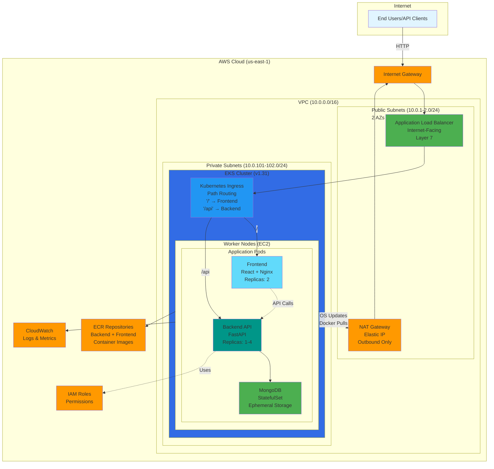

# Fictions API - Production-Ready Containerized Web Application

A full-stack containerized web application demonstrating modern DevOps practices, cloud deployment, and scalable architecture. Built with Python/FastAPI, deployed on AWS EKS with complete infrastructure as code.

> **Portfolio Project** - Showcasing end-to-end development and deployment capabilities

[](https://www.python.org/)
[](https://fastapi.tiangolo.com/)
[](https://www.docker.com/)
[](https://kubernetes.io/)
[](https://www.terraform.io/)
[](https://aws.amazon.com/eks/)

## TL;DR

- **Full-stack Fictions web app**: React frontend + FastAPI backend + MongoDB
- **Fully containerized & deployed to AWS EKS** behind an ALB Ingress using Terraform + Kubernetes
- **Includes JWT auth, rate limiting, HPA**, and **local + AWS + CI/CD** deployment paths

---

## 📋 Table of Contents

- [Features](#-features)
- [Tech Stack](#-tech-stack)
- [Architecture](#-architecture)
- [Quickstart for Reviewers](#-quickstart-for-reviewers)
- [Prerequisites](#-prerequisites)
- [Deployment & Testing](#-deployment--testing)
  - [Approach 1: Local Development](#approach-1-local-development)
  - [Approach 2: Manual AWS Deployment](#approach-2-manual-aws-deployment)
  - [Approach 3: CI/CD Deployment](#approach-3-cicd-deployment)
- [Demo & Testing Flows](#-demo--testing-flows)
- [API Documentation](#-api-documentation)
- [Project Structure](#-project-structure)
- [Security Features](#-security-features)
- [Key Highlights](#-key-highlights)

---

## 🚀 Features

- ✅ **Full-Stack Application:** React frontend + FastAPI backend
- ✅ **RESTful API:** CRUD operations for fictions
- ✅ **Web UI:** Interactive React interface with routing
- ✅ **Authentication:** JWT with bcrypt password hashing
- ✅ **Rate Limiting:** 100 requests/15 min (SlowAPI)
- ✅ **Database:** MongoDB with async driver (Motor)
- ✅ **Containerization:** Multi-stage Docker builds (2 images)
- ✅ **Kubernetes:** Orchestration on AWS EKS with Ingress
- ✅ **Infrastructure as Code:** Terraform for AWS resources
- ✅ **Auto-scaling:** HPA + Cluster Autoscaler
- ✅ **Load Balancing:** ALB with path-based routing
- ✅ **CI/CD:** GitHub Actions pipelines

---

## 🛠️ Tech Stack

**Frontend:** React 18, Vite, React Router, Vanilla CSS  
**Backend:** Python 3.11, FastAPI, MongoDB 7.0, Motor, JWT, bcrypt, Pydantic, SlowAPI  
**Infrastructure:** AWS (EKS, ECR, VPC, ALB), Terraform, Kubernetes, Ingress  
**Tools:** Docker, kubectl, AWS CLI, GitHub Actions

---

## 🏗️ Architecture

### AWS Infrastructure Diagram



### Network Architecture Details

- **VPC:** 10.0.0.0/16 across 2 Availability Zones (High Availability)
- **Public Subnets:** 10.0.1.0/24, 10.0.2.0/24
  - Internet-facing ALB (Application Load Balancer - Layer 7)
  - NAT Gateway (for private subnet outbound traffic)
  - Routes: 0.0.0.0/0 → Internet Gateway
- **Private Subnets:** 10.0.101.0/24, 10.0.102.0/24
  - EKS worker nodes (private IPs only - no direct internet access)
  - All application pods (Frontend, Backend API, MongoDB)
  - Kubernetes Ingress Controller (path-based routing)
  - Routes: 0.0.0.0/0 → NAT Gateway
- **Internet Gateway:** Bi-directional internet access for public subnets
- **NAT Gateway:** Outbound-only internet for private subnets (OS updates, Docker pulls)

### Traffic Flow

**Inbound (User → Frontend):**
```
User's Web Browser
  ↓
Internet Gateway
  ↓
ALB in Public Subnet (10.0.1.x)
  ↓ Layer 7 routing based on path
Kubernetes Ingress Controller
  ↓ Path: "/"
Frontend Pod (Nginx, port 80)
  ↓ JavaScript API calls to "/api"
Backend API Pod (FastAPI, port 3000)
  ↓
MongoDB Pod
```

**Inbound (Direct API Access):**
```
API Client
  ↓
Internet Gateway
  ↓
ALB in Public Subnet (10.0.1.x)
  ↓ Layer 7 routing based on path
Kubernetes Ingress Controller
  ↓ Path: "/api/*"
Backend API Pod (FastAPI, port 3000)
  ↓
MongoDB Pod
```

**Key Point:** ALB is Layer 7 (Application Load Balancer) with intelligent path-based routing. The Ingress Controller routes:
- `/` → Frontend Service → Frontend Pods
- `/api/*` → Backend Service → Backend API Pods

**Outbound (Nodes → Internet):**
```
Worker Nodes (Private Subnet)
  ↓
NAT Gateway (Public Subnet)
  ↓
Internet Gateway
  ↓
Internet (Docker Hub, GitHub, OS updates)
```

---

## 🚀 Quickstart for Reviewers

**Want to see it in action?** Here are the fastest ways:

### **Option 1: Run Locally** (5 minutes, free)

```bash
# Start all services (frontend + backend + database)
./dev-tools/start-local.sh

# Access the application
# Frontend UI:    http://localhost
# Swagger API:    http://localhost:3000/api/docs
# Health Check:   http://localhost:3000/health
```

Test the full flow: Register → Login → Create fiction → Edit → Delete

### **Option 2: Deploy to AWS** (20 minutes, ~$2-3)

```bash
# 1. Create S3 backend for Terraform state
aws s3api create-bucket --bucket fictions-api-terraform-state-development --region us-east-1

# 2. Deploy infrastructure
cd infrastructure/terraform-eks
terraform init
terraform apply  # Type 'yes' when prompted

# 3. Deploy application
kubectl apply -f ../../kubernetes/

# 4. Get application URL
kubectl get ingress fictions-app-ingress -n fictions-app
# Open the ALB hostname in your browser
```

### **Option 3: CI/CD Deployment** (automated)

Push to `main` branch or use GitHub Actions manual trigger - fully automated deployment!

---

**📖 For detailed step-by-step instructions**, see [Deployment & Testing](#-deployment--testing) below.

---

## 📦 Prerequisites

<details>
<summary><b>Click to see prerequisites</b></summary>

### For Local Development

| Tool | Version | Installation |
|------|---------|--------------|
| **Docker Desktop** | Latest | [Download](https://www.docker.com/products/docker-desktop/) |
| **Git** | Latest | [Download](https://git-scm.com/downloads) |

### For AWS EKS Deployment

| Tool | Version | Installation |
|------|---------|--------------|
| **AWS CLI** | v2 | [Install Guide](https://docs.aws.amazon.com/cli/latest/userguide/getting-started-install.html) |
| **kubectl** | 1.31+ | [Install Guide](https://kubernetes.io/docs/tasks/tools/) |
| **Terraform** | 1.10+ | [Download](https://www.terraform.io/downloads) |

**AWS Account Setup:**
```bash
# Configure credentials
aws configure

# Verify access
aws sts get-caller-identity
```

</details>

---

## 🚀 Deployment & Testing

Choose your deployment approach based on your needs:

| Approach | Time | Use Case |
|----------|------|----------|
| **[Local Development](#approach-1-local-development--testing)** | 5 min | Quick testing & development |
| **[Manual AWS Deployment](#approach-2-manual-aws-deployment--testing)** | 20 min | Full control via CLI |
| **[CI/CD Deployment](#approach-3-cicd-deployment--testing)** | 20 min | Automated deployment |

---

### Approach 1: Local Development

> ⏱️ **5 minutes** | 💰 **Free** | 🎯 **Perfect for development**

#### **Step 1: Clone Repository**

```bash
git clone https://github.com/<your-username>/webapp-devops.git
cd webapp-devops
```

#### **Step 2: Start Application**

```bash
./dev-tools/start-local.sh
```

**Expected output:**
```
🌐 FULL-STACK APPLICATION:
   Frontend (React UI):     http://localhost
   Backend API (FastAPI):   http://localhost:3000
   Database (MongoDB):      localhost:27017
```

**What's Running:**
- 🎨 **Frontend** - React UI on port 80
- ⚚ **Backend** - FastAPI on port 3000  
- 🗄️ **MongoDB** - Database on port 27017

#### **Step 3: Access & Test**

**Quick Test Options:**

```bash
# Option A: Frontend UI (Recommended)
open http://localhost

# Option B: Swagger UI (API Testing)
open http://localhost:3000/api/docs

# Option C: Automated Testing Script
./dev-tools/test-api.sh

# Option D: Manual Health Check
curl http://localhost:3000/health
```

**📖 For complete demo flows** (register → login → create → edit → delete), see:
- [Frontend UI Demo](#frontend-ui-demo-recommended)
- [Swagger UI Demo](#swagger-ui-demo-api-testing)
- [Rate Limiting Demo](#rate-limiting-demo)

#### **Step 4: View Logs (Optional)**

```bash
# All services
docker-compose logs -f

# Frontend only
docker-compose logs -f frontend

# Backend only
docker-compose logs -f api

# MongoDB only
docker-compose logs -f mongodb
```

#### **Step 5: Stop Application**

```bash
./dev-tools/stop-local.sh
```

**Clean Restart (Remove all data):**
```bash
docker-compose down -v
./dev-tools/start-local.sh
```

---

**🎯 Quick Reference - Local URLs:**

| Service | URL | Description |
|---------|-----|-------------|
| **Frontend UI** | http://localhost | React web application |
| **Backend API** | http://localhost:3000 | FastAPI REST API |
| **Swagger UI** | http://localhost:3000/api/docs | Interactive API docs |
| **Health Check** | http://localhost:3000/health | API health status |
| **MongoDB** | localhost:27017 | Database (internal) |

---

### Approach 2: Manual AWS Deployment

> ⏱️ **20 minutes** | 💰 **~$2-3 per demo** | 🎯 **Full control via CLI**

#### **Step 1: Setup S3 Backend (One-time)**

```bash
# Create S3 bucket for Terraform state
aws s3api create-bucket \
  --bucket fictions-api-terraform-state-development \
  --region us-east-1

# Enable versioning
aws s3api put-bucket-versioning \
  --bucket fictions-api-terraform-state-development \
  --versioning-configuration Status=Enabled
```

#### **Step 2: Deploy Infrastructure**

```bash
cd infrastructure/terraform-eks

# Initialize and deploy (~15-20 minutes)
terraform init
terraform apply
# Type 'yes' when prompted
```

**What gets created:** VPC, EKS Cluster, Load Balancer, Security Groups, IAM Roles

**Expected output:**
```
Apply complete! Resources: 50+ added, 0 changed, 0 destroyed.
```

#### **Step 3: Connect to EKS**

```bash
# Connect kubectl to EKS
aws eks update-kubeconfig --region us-east-1 --name fictions-api

# Verify connection
kubectl get nodes
# Expected: 1-2 nodes in "Ready" status
```

#### **Step 4: Build & Push Backend**

```bash
# Get AWS account ID
export AWS_ACCOUNT_ID=$(aws sts get-caller-identity --query Account --output text)
export BACKEND_ECR="${AWS_ACCOUNT_ID}.dkr.ecr.us-east-1.amazonaws.com/fictions-api-development"

# Login to ECR
aws ecr get-login-password --region us-east-1 | \
  docker login --username AWS --password-stdin ${AWS_ACCOUNT_ID}.dkr.ecr.us-east-1.amazonaws.com

# Build and push backend
docker build -t backend ./backend
docker tag backend:latest ${BACKEND_ECR}:latest
docker push ${BACKEND_ECR}:latest
```

#### **Step 5: Build & Push Frontend**

```bash
export FRONTEND_ECR="${AWS_ACCOUNT_ID}.dkr.ecr.us-east-1.amazonaws.com/fictions-api-frontend-development"

# Build and push frontend
docker build -t frontend ./frontend
docker tag frontend:latest ${FRONTEND_ECR}:latest
docker push ${FRONTEND_ECR}:latest
```

#### **Step 6: Update Deployment Files**

```bash
# Update backend deployment
cd kubernetes
sed -i.bak "s|image:.*|image: ${BACKEND_ECR}:latest|" backend-deployment.yaml
rm -f backend-deployment.yaml.bak

# Update frontend deployment
sed -i.bak "s|image:.*|image: ${FRONTEND_ECR}:latest|" frontend-deployment.yaml
rm -f frontend-deployment.yaml.bak
```

#### **Step 7: Deploy to Kubernetes**

```bash
# Deploy all resources
kubectl apply -f namespace.yaml
kubectl apply -f configmap.yaml
kubectl apply -f secrets.yaml
kubectl apply -f mongodb.yaml
kubectl apply -f backend-deployment.yaml
kubectl apply -f backend-service.yaml
kubectl apply -f frontend-deployment.yaml
kubectl apply -f frontend-service.yaml
kubectl apply -f ingress.yaml
kubectl apply -f hpa.yaml

# Wait for pods (2-3 minutes)
kubectl wait --for=condition=ready pod -l app=fictions-api -n fictions-app --timeout=300s
kubectl wait --for=condition=ready pod -l app=frontend -n fictions-app --timeout=300s
kubectl wait --for=condition=ready pod -l app=mongodb -n fictions-app --timeout=300s
```

**Expected:** All pods in "Running" status

#### **Step 4: Get Application URL**

```bash
# Wait for ALB (2-3 minutes)
echo "Waiting for ALB to provision..."
sleep 120

# Get ALB URL from Ingress
export APP_URL=$(kubectl get ingress fictions-app-ingress -n fictions-app \
  -o jsonpath='{.status.loadBalancer.ingress[0].hostname}')

echo "✅ Frontend:    http://$APP_URL"
echo "✅ Backend API: http://$APP_URL/api"
echo "✅ Swagger UI:  http://$APP_URL/api/docs"

# Test
curl http://$APP_URL/health
```

**Expected:**
```json
{"status":"ok","app":"Fictions API","version":"1.0.0"}
```

#### **Step 5: Test on AWS**

**Quick Access:**

```bash
# Frontend UI
open http://$APP_URL

# Swagger UI
open http://$APP_URL/api/docs

# Health check
curl http://$APP_URL/health
```

**📖 For complete demo flows**, see:
- [Frontend UI Demo](#frontend-ui-demo-recommended) - Full register → login → CRUD flow
- [Swagger UI Demo](#swagger-ui-demo-api-testing) - API testing with authentication
- [Rate Limiting Demo](#rate-limiting-demo) - Test rate limiting behavior

#### **Step 6: Cleanup (Destroy to Save Costs)**

```bash
# Delete Kubernetes resources
kubectl delete namespace fictions-app

# Destroy infrastructure
cd infrastructure/terraform-eks
terraform destroy
# Type 'yes' when prompted
```

**💰 Cost saved!** All AWS resources destroyed.

---

### Approach 3: CI/CD Deployment

> ⏱️ **20 minutes** | 🤖 **Fully automated** | 🎯 **Best for demos**

**CI/CD Pipeline Overview:**


*Automated pipeline: Validate → Build Images → Deploy Infrastructure → Deploy Applications → Destroy (manual approval)*

---

#### **Step 1: Add GitHub Secrets**

1. Go to your GitHub repository
2. **Settings** → **Secrets and variables** → **Actions**
3. **New repository secret** → Add both:
   - Name: `AWS_ACCESS_KEY_ID` | Value: Your AWS access key
   - Name: `AWS_SECRET_ACCESS_KEY` | Value: Your AWS secret key

#### **Step 2: Create S3 Backend (One-time)**

```bash
aws s3api create-bucket \
  --bucket fictions-api-terraform-state-development \
  --region us-east-1

aws s3api put-bucket-versioning \
  --bucket fictions-api-terraform-state-development \
  --versioning-configuration Status=Enabled
```

#### **Step 3: Trigger Deployment**

**Option A: Push to main (automatic)**
```bash
git add .
git commit -m "deploy: initial deployment"
git push origin main
```

**Option B: Manual trigger**
1. GitHub → **Actions** tab
2. **CI/CD Pipeline** workflow
3. **Run workflow** → Select `deploy` → **Run workflow**

**Monitor:**
- **Actions** tab → Click running workflow
- Watch: Validate → Deploy Infra → Build → Deploy K8s
- Wait ~20 minutes

**Expected:** Green checkmarks on all jobs, "🚀 Deployment Successful!" message

#### **Step 4: Get Application URL & Test**

After deployment completes:

```bash
# Connect to EKS
aws eks update-kubeconfig --region us-east-1 --name fictions-api

# Get ALB URL from Ingress
export APP_URL=$(kubectl get ingress fictions-app-ingress -n fictions-app \
  -o jsonpath='{.status.loadBalancer.ingress[0].hostname}')

echo "Frontend:   http://$APP_URL"
echo "Backend:    http://$APP_URL/api"
echo "Swagger UI: http://$APP_URL/api/docs"

# Test
curl http://$APP_URL/health
```

**Or:** Check the GitHub Actions workflow output for the URL!

**Quick Access:**

```bash
# Frontend UI
open http://$APP_URL

# Swagger UI
open http://$APP_URL/api/docs

# Health check
curl http://$APP_URL/health
```

**📖 For complete demo flows**, see:
- [Frontend UI Demo](#frontend-ui-demo-recommended) - Full register → login → CRUD flow
- [Swagger UI Demo](#swagger-ui-demo-api-testing) - API testing with authentication
- [Rate Limiting Demo](#rate-limiting-demo) - Test rate limiting behavior

#### **Step 5: Destroy (Save Costs)**

1. **Actions** tab → **CI/CD Pipeline**
2. **Run workflow** → Select `destroy` → **Run workflow**
3. **Approve** when prompted
4. Wait ~10 minutes

**✅ Done!** All AWS resources deleted, $0 charges.

---

## 🎯 Demo & Testing Flows

> **Referenced by all deployment approaches above** - Use these flows after deploying locally or on AWS

### Frontend UI Demo (Recommended)

**Access:** 
- Local: `http://localhost`
- AWS: `http://$APP_URL`

**Complete Demo Flow:**

1. **Register User**
   - Click "Register"
   - Fill: Username, Email, Password
   - Click "Sign Up"
   - ✅ Success: Redirects to login

2. **Login**
   - Enter email & password
   - Click "Login"
   - ✅ Success: Shows fictions list (empty initially)

3. **Create Fiction**
   - Click "Create New Fiction"
   - Fill form:
     - Title: "My First Story"
     - Author: "Your Name"
     - Genre: fantasy, sci-fi, mystery, or romance
     - Description: "A brief summary"
     - Content: "Your story content..."
   - Click "Create"
   - ✅ Success: Fiction appears in list with "Your Story" badge

4. **View Fictions**
   - See all fictions from all users
   - Your fictions show "Your Story" badge
   - Your fictions have Edit/Delete buttons

5. **Edit Your Fiction**
   - Click "Edit" on your fiction
   - Update any field
   - Click "Update"
   - ✅ Success: Changes saved

6. **Delete Fiction**
   - Click "Delete" on your fiction
   - Confirm deletion
   - ✅ Success: Fiction removed from list

7. **Test Authorization**
   - Register a second user (different email)
   - Login with second user
   - Notice: Can't edit/delete first user's fictions
   - ✅ Success: Authorization working!

8. **Logout**
   - Click "Logout"
   - ✅ Success: Redirects to login page

---

### Swagger UI Demo (API Testing)

**Access:**
- Local: `http://localhost:3000/api/docs`
- AWS: `http://$APP_URL/api/docs`

**Complete API Demo Flow:**

1. **Register User**
   - Expand: `POST /api/auth/register`
   - Click: "Try it out"
   - Fill:
     ```json
     {
       "username": "demo",
       "email": "demo@example.com",
       "password": "test123"
     }
     ```
   - Click: "Execute"
   - ✅ Success: Returns user object + token

2. **Login**
   - Expand: `POST /api/auth/login`
   - Click: "Try it out"
   - Fill:
     ```json
     {
       "email": "demo@example.com",
       "password": "test123"
     }
     ```
   - Click: "Execute"
   - **Copy the token from response**

3. **Authorize**
   - Click: 🔓 "Authorize" button (top right)
   - Paste token in "Value" field
   - Click: "Authorize"
   - Click: "Close"
   - ✅ Success: Now authenticated!

4. **Create Fiction**
   - Expand: `POST /api/fictions/`
   - Click: "Try it out"
   - Fill:
     ```json
     {
       "title": "Test Story",
       "author": "Demo Author",
       "genre": "fantasy",
       "description": "A test fiction",
       "content": "Once upon a time..."
     }
     ```
   - Click: "Execute"
   - ✅ Success: Returns fiction with ID

5. **Get All Fictions**
   - Expand: `GET /api/fictions/`
   - Click: "Try it out" → "Execute"
   - ✅ Success: Returns list with your fiction

6. **Update Fiction**
   - Expand: `PUT /api/fictions/{id}`
   - Enter the fiction ID from step 4
   - Click: "Try it out"
   - Modify any field
   - Click: "Execute"
   - ✅ Success: Fiction updated

7. **Delete Fiction**
   - Expand: `DELETE /api/fictions/{id}`
   - Enter fiction ID
   - Click: "Try it out" → "Execute"
   - ✅ Success: Fiction deleted

---

### Rate Limiting Demo

**The API enforces 100 requests per 15 minutes per IP**

**Check Rate Limit Headers:**

```bash
# Local
curl -I http://localhost:3000/health | grep -i ratelimit

# AWS
curl -I http://$APP_URL/health | grep -i ratelimit
```

**Expected Response Headers:**
```
X-RateLimit-Limit: 100
X-RateLimit-Remaining: 99
X-RateLimit-Reset: <timestamp>
```

**Test Rate Limiting Behavior:**

| Requests | Status | Response |
|----------|--------|----------|
| 1-100 | ✅ Success | 200 OK |
| 101+ | ❌ Blocked | 429 Too Many Requests |
| After 15 min | ✅ Reset | Counter resets to 0 |

**Trigger Rate Limit (Demo):**

```bash
# Make 101 rapid requests
for i in {1..101}; do
  echo "Request $i"
  curl -s http://localhost:3000/health > /dev/null  # or use $APP_URL for AWS
done

# Next request will fail with 429
curl -v http://localhost:3000/health  # or $APP_URL
# Expected: HTTP 429 Too Many Requests
```

---

## 📖 API Documentation

### Endpoints Overview

| Endpoint | Method | Description | Auth Required |
|----------|--------|-------------|---------------|
| `/health` | GET | Health check | No |
| `/api/docs` | GET | Swagger UI documentation | No |
| `/api/auth/register` | POST | Register new user | No |
| `/api/auth/login` | POST | Login and get JWT token | No |
| `/api/fictions/` | GET | List all fictions | Yes |
| `/api/fictions/` | POST | Create new fiction | Yes |
| `/api/fictions/{id}` | GET | Get fiction by ID | Yes |
| `/api/fictions/{id}` | PUT | Update fiction | Yes |
| `/api/fictions/{id}` | DELETE | Delete fiction | Yes |

### Interactive Documentation

When the API is running, visit:
- **Swagger UI:** 
  - Local: `http://localhost:3000/api/docs`
  - AWS: Use the LoadBalancer URL from Step 7 (e.g., `http://k8s-fictions-xxx.elb.us-east-1.amazonaws.com/api/docs`)
  - Interactive API documentation with "Try it out" functionality
  - Test all endpoints directly from your browser

### API Field Reference

> **⚠️ Important:** Pay close attention to field names - common mistakes include using `name` instead of `username`, `access_token` instead of `token`, or `summary` instead of `description`.

#### User Registration (`POST /api/auth/register`)

**Required Fields:**
```json
{
  "username": "string",    // 3-30 characters, alphanumeric + underscore/hyphen
  "email": "string",       // Valid email format (e.g., user@example.com)
  "password": "string"     // Minimum 6 characters
}
```

**Response:**
```json
{
  "token": "eyJhbGciOiJIUzI1NiIs...",  // JWT token for authentication
  "token_type": "bearer",
  "user": {
    "_id": "...",
    "username": "...",
    "email": "...",
    "created_at": "..."
  }
}
```

#### User Login (`POST /api/auth/login`)

**Required Fields:**
```json
{
  "email": "string",      // Registered email address
  "password": "string"    // User's password
}
```

**Response:**
```json
{
  "token": "eyJhbGciOiJIUzI1NiIs...",  // Use this token in Authorization header
  "token_type": "bearer",
  "user": { ... }
}
```

#### Create Fiction (`POST /api/fictions/`)

**Required Fields:**
```json
{
  "title": "string",        // 1-200 characters
  "author": "string",       // 1-100 characters
  "genre": "string",        // Must be lowercase: fantasy, sci-fi, mystery, romance, 
                            // thriller, horror, adventure, drama, comedy, other
  "description": "string",  // ⚠️ NOT "summary"! Max 500 characters
  "content": "string"       // Minimum 1 character
}
```

**Valid Genres:**
- `fantasy`, `sci-fi`, `mystery`, `romance`, `thriller`, `horror`, `adventure`, `drama`, `comedy`, `other`

**Authorization Required:**
- Add header: `Authorization: Bearer <your-token-here>`

#### Update Fiction (`PUT /api/fictions/{id}`)

Same fields as Create Fiction (all fields required).

#### Common Mistakes to Avoid

| ❌ Wrong Field | ✅ Correct Field | Endpoint |
|----------------|------------------|----------|
| `"name"` | `"username"` | `/api/auth/register` |
| `"access_token"` | `"token"` | Response from login/register |
| `"summary"` | `"description"` | `/api/fictions/` |
| `"Fantasy"` | `"fantasy"` | `/api/fictions/` (genre must be lowercase) |
| `"Sci-Fi"` | `"sci-fi"` | `/api/fictions/` (genre must be lowercase) |

### Example Usage

For detailed examples and interactive testing, use the **Swagger UI** at `/api/docs` endpoint.

---

## 📁 Project Structure

```
webapp-devops/                    # Monorepo (Frontend + Backend + Infrastructure)
│
├── backend/                      # Backend application (Python/FastAPI)
│   ├── src/                     # Application source code
│   │   ├── main.py              # FastAPI entry point
│   │   ├── config/              # Settings, database
│   │   ├── models/              # Pydantic models (User, Fiction)
│   │   ├── routers/             # API endpoints (auth, fictions)
│   │   ├── middleware/          # Auth, rate limiting
│   │   └── utils/               # Password hashing
│   ├── Dockerfile               # Backend Docker build
│   ├── requirements.txt         # Python dependencies
│   └── README.md                # Backend documentation
│
├── frontend/                     # Frontend application (React)
│   ├── src/                     # React source code
│   │   ├── App.jsx              # Main app component
│   │   ├── components/          # React components
│   │   │   ├── Login.jsx        # Auth UI
│   │   │   ├── Fictions.jsx     # Main page
│   │   │   ├── FictionForm.jsx  # Create/Edit form
│   │   │   └── ...
│   │   ├── services/            # API client
│   │   └── index.css            # Styles
│   ├── Dockerfile               # Frontend Docker build (Nginx)
│   ├── package.json             # npm dependencies
│   └── README.md                # Frontend documentation
│
├── infrastructure/               # Infrastructure as Code
│   └── terraform-eks/           # Terraform for AWS EKS
│       ├── backend.tf           # Terraform backend (S3 state)
│       ├── provider.tf          # AWS, Kubernetes, Helm providers
│       ├── vpc.tf               # VPC, subnets, gateways
│       ├── eks.tf               # EKS cluster configuration
│       ├── ecr.tf               # 2 ECR repos (backend + frontend)
│       ├── addons.tf            # Load Balancer Controller, Metrics, Autoscaler
│       ├── variables.tf         # Input variables
│       └── outputs.tf           # ECR URLs, cluster info
│
├── kubernetes/                   # Kubernetes manifests
│   ├── namespace.yaml           # fictions-app namespace
│   ├── configmap.yaml           # App configuration
│   ├── secrets.yaml             # JWT, MongoDB credentials
│   ├── mongodb.yaml             # MongoDB StatefulSet
│   ├── backend-deployment.yaml  # Backend API deployment
│   ├── backend-service.yaml     # Backend service (ClusterIP)
│   ├── frontend-deployment.yaml # Frontend deployment
│   ├── frontend-service.yaml    # Frontend service (ClusterIP)
│   ├── ingress.yaml             # ALB Ingress (path routing)
│   ├── hpa.yaml                 # Horizontal Pod Autoscaler
│   └── kustomization.yaml       # Kustomize config
│
├── ops-tools/                    # DevOps automation scripts
│   ├── build-and-push.sh        # Build & push backend to ECR
│   ├── build-and-push-frontend.sh # Build & push frontend to ECR
│   ├── update-k8s-image.sh      # Update K8s deployments
│   └── deploy-kubectl.sh        # Deploy to Kubernetes
│
├── dev-tools/                    # Developer tools
│   ├── start-local.sh           # Start Docker Compose
│   ├── stop-local.sh            # Stop local environment
│   └── test-api.sh              # Test API endpoints
│
├── .github/workflows/            # CI/CD pipelines
│   ├── ci.yml                   # Build, test, deploy
│   └── pr.yml                   # PR validation
│
├── docker-compose.yml            # Local dev (backend + frontend + MongoDB)
└── README.md                     # Complete documentation
```

---

## 🔐 Security Features

### Application Security
- ✅ JWT authentication with bcrypt password hashing
- ✅ Rate limiting (100 requests per 15 minutes)
- ✅ Input validation with Pydantic
- ✅ Kubernetes Secrets for credentials

### Infrastructure Security
- ✅ **Private Subnets:** Worker nodes have no public IPs
- ✅ **NAT Gateway:** Outbound-only internet for updates
- ✅ **Security Groups:** 
  - Control Plane: Protects Kubernetes API server
  - Worker Nodes: Controlled access from ALB
  - ALB: Layer 7 load balancing with path-based routing
- ✅ **IAM Roles:** Least privilege for EKS, worker nodes, load balancer controller, autoscaler
- ✅ **VPC Isolation:** Network segregation across 2 AZs
- ✅ **Kubernetes Ingress:** Path-based routing isolates frontend and backend traffic

---

## 🔧 Troubleshooting

### Local Development Issues

**Problem: "Docker daemon not running"**
```bash
# Solution: Start Docker Desktop and wait for it to fully start
```

**Problem: "Port 3000 already in use"**
```bash
# Solution: Stop existing container
docker-compose down
# Or kill the process using port 3000
lsof -ti:3000 | xargs kill -9
```

**Problem: "Health check failed"**
```bash
# Check logs
docker-compose logs api
docker-compose logs mongodb
```

### AWS Deployment Issues

**Problem: "Error creating bucket: BucketAlreadyExists"**
```bash
# Solution: Bucket name must be globally unique, change in backend.tf:
# bucket = "fictions-api-terraform-state-YOUR-NAME"
```

**Problem: "LoadBalancer stuck in Pending"**
```bash
# Check AWS Load Balancer Controller logs
kubectl logs -n kube-system deployment/aws-load-balancer-controller

# Verify AWS Load Balancer Controller is running
kubectl get pods -n kube-system | grep aws-load-balancer-controller
```

**Problem: "Pods stuck in ImagePullBackOff"**
```bash
# Check if image was pushed to ECR
aws ecr list-images --repository-name fictions-api-development

# Verify deployment has correct image URL
kubectl describe pod -n fictions-app <pod-name>
```

**Problem: "kubectl: connection refused"**
```bash
# Re-configure kubectl
aws eks update-kubeconfig --region us-east-1 --name fictions-api

# Verify cluster exists
aws eks list-clusters --region us-east-1
```

### API Testing Issues

**Problem: "Login failed / 422 Unprocessable Entity"**
- Check field names: Use `username` (not `name`), `email`, `password`
- Ensure genre is lowercase: `fantasy` (not `Fantasy`)
- Use `description` (not `summary`) for fictions

**Problem: "401 Unauthorized"**
```bash
# Verify token is included in Authorization header
curl -H "Authorization: Bearer YOUR_TOKEN_HERE" ...
```

### Need More Help?

1. Check application logs: `kubectl logs -n fictions-app deployment/fictions-api`
2. Check MongoDB logs: `kubectl logs -n fictions-app statefulset/mongodb`
3. Verify all pods are running: `kubectl get pods -n fictions-app`
4. Check Swagger UI for API documentation: `/api/docs`

---

## 🎯 Key Highlights

**Full Stack**
- React SPA frontend + FastAPI backend
- RESTful API with JWT authentication & rate limiting
- MongoDB database with async driver
- Interactive Swagger UI documentation

**Cloud & Kubernetes**
- Deployed on AWS EKS behind an internet-facing ALB
- Kubernetes Deployments, Services, Ingress, and HPA
- Path-based routing (Ingress Controller) for frontend + backend
- Horizontal Pod Autoscaler + Cluster Autoscaler for high availability

**DevOps & IaC**
- Multi-stage Docker builds (2 images: frontend + backend)
- Terraform for VPC, EKS, ECR, ALB, and AWS Load Balancer Controller
- GitHub Actions CI/CD: validate → build → deploy infrastructure → deploy apps
- Automated testing scripts + health check endpoints

**Security & Reliability**
- Private subnets for EKS nodes, public subnets for ALB
- Security groups with least-privilege access
- IAM roles for service accounts (IRSA)
- Kubernetes Secrets for sensitive data
- Rate limiting (100 req/15 min) to prevent API abuse

---

**Ready to deploy?** Start with [Approach 1: Local Development](#approach-1-local-development)! 🚀
