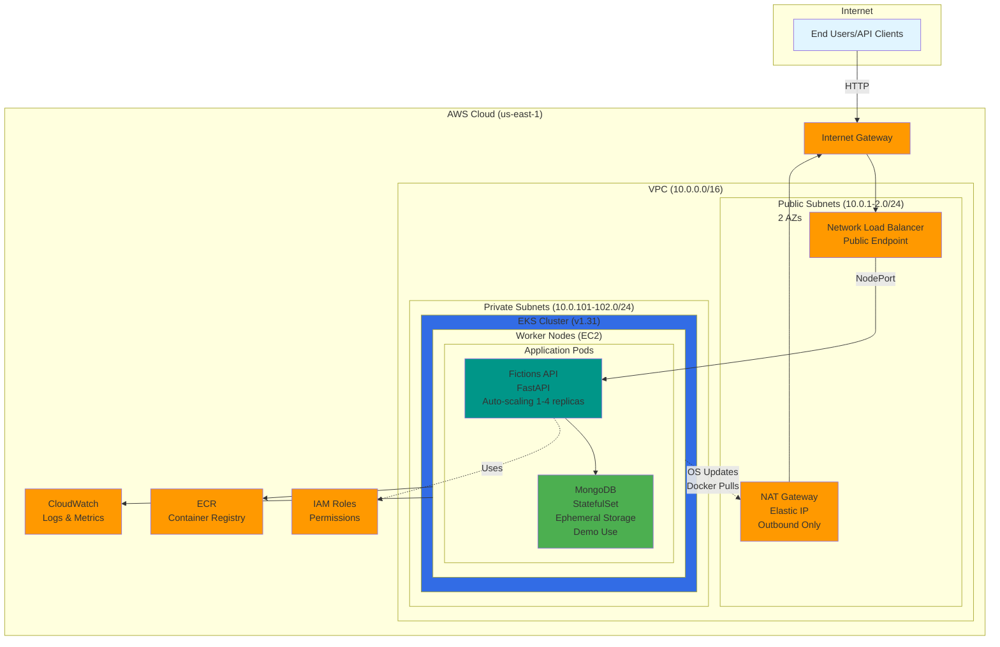

# Fictions API - Production-Ready Containerized Web Application

A full-stack containerized web application demonstrating modern DevOps practices, cloud deployment, and scalable architecture. Built with Python/FastAPI, deployed on AWS EKS with complete infrastructure as code.

> **Portfolio Project** - Showcasing end-to-end development and deployment capabilities

[](https://www.python.org/)
[](https://fastapi.tiangolo.com/)
[](https://www.docker.com/)
[](https://kubernetes.io/)
[](https://www.terraform.io/)
[](https://aws.amazon.com/eks/)

---

## 📋 Table of Contents

- [Features](#-features)
- [Tech Stack](#-tech-stack)
- [Architecture](#-architecture)
- [Prerequisites](#-prerequisites)
- [Deployment & Testing](#-deployment--testing)
  - [Approach 1: Local Development](#approach-1-local-development--testing)
  - [Approach 2: Manual AWS Deployment](#approach-2-manual-aws-deployment--testing)
  - [Approach 3: CI/CD Deployment](#approach-3-cicd-deployment--testing)
- [API Documentation](#-api-documentation)
- [Project Structure](#-project-structure)
- [Security Features](#-security-features)
- [Key Highlights](#-key-highlights)

---

## 🚀 Features

- ✅ RESTful API with CRUD operations for fictions
- ✅ JWT authentication with bcrypt password hashing
- ✅ Rate limiting (100 requests/15 min)
- ✅ MongoDB with async driver (Motor)
- ✅ Auto-generated API docs (Swagger UI)
- ✅ Docker containerization
- ✅ Kubernetes orchestration on AWS EKS
- ✅ Infrastructure as Code (Terraform)
- ✅ Auto-scaling (HPA + Cluster Autoscaler)
- ✅ Network Load Balancer (internet-facing)
- ✅ CI/CD ready with GitHub Actions

---

## 🛠️ Tech Stack

**Backend:** Python 3.11, FastAPI, MongoDB 7.0, Motor, JWT, bcrypt, Pydantic, SlowAPI  
**Infrastructure:** AWS (EKS, ECR, VPC, NLB), Terraform, Kubernetes  
**Tools:** Docker, kubectl, AWS CLI, GitHub Actions

---

## 🏗️ Architecture

### AWS Infrastructure Diagram



### Network Architecture Details

- **VPC:** 10.0.0.0/16 across 2 Availability Zones (High Availability)
- **Public Subnets:** 10.0.1.0/24, 10.0.2.0/24
  - Internet-facing NLB (receives internet traffic)
  - NAT Gateway (for private subnet outbound traffic)
  - Routes: 0.0.0.0/0 → Internet Gateway
- **Private Subnets:** 10.0.101.0/24, 10.0.102.0/24
  - EKS worker nodes (private IPs only - no direct internet access)
  - All application pods (FastAPI, MongoDB)
  - Routes: 0.0.0.0/0 → NAT Gateway
- **Internet Gateway:** Bi-directional internet access for public subnets
- **NAT Gateway:** Outbound-only internet for private subnets (OS updates, Docker pulls)

### Traffic Flow

**Inbound (User → API):**
```
Internet Client (203.0.113.x)
  ↓
Internet Gateway
  ↓
NLB in Public Subnet (10.0.1.x)
  ↓ (preserves client IP)
Worker Node in Private Subnet (10.0.101.x)
  ↓
NodePort Service (30000-32767)
  ↓
FastAPI Pod (port 3000)
```

**Key Point:** NLB is Layer 4 (preserves source IP), so worker node security group sees the actual client IP, not NLB IP.

**Outbound (Nodes → Internet):**
```
Worker Nodes (Private Subnet)
  ↓
NAT Gateway (Public Subnet)
  ↓
Internet Gateway
  ↓
Internet (Docker Hub, GitHub, OS updates)
```

---

## 📦 Prerequisites

<details>
<summary><b>Click to see prerequisites</b></summary>

### For Local Development

| Tool | Version | Installation |
|------|---------|--------------|
| **Docker Desktop** | Latest | [Download](https://www.docker.com/products/docker-desktop/) |
| **Git** | Latest | [Download](https://git-scm.com/downloads) |

### For AWS EKS Deployment

| Tool | Version | Installation |
|------|---------|--------------|
| **AWS CLI** | v2 | [Install Guide](https://docs.aws.amazon.com/cli/latest/userguide/getting-started-install.html) |
| **kubectl** | 1.31+ | [Install Guide](https://kubernetes.io/docs/tasks/tools/) |
| **Terraform** | 1.10+ | [Download](https://www.terraform.io/downloads) |

**AWS Account Setup:**
```bash
# Configure credentials
aws configure

# Verify access
aws sts get-caller-identity
```

</details>

---

## 🚀 Deployment & Testing

Choose your deployment approach based on your needs:

| Approach | Time | Use Case |
|----------|------|----------|
| **[Local Development](#approach-1-local-development--testing)** | 5 min | Quick testing & development |
| **[Manual AWS Deployment](#approach-2-manual-aws-deployment--testing)** | 20 min | Full control via CLI |
| **[CI/CD Deployment](#approach-3-cicd-deployment--testing)** | 20 min | Automated deployment |

---

### Approach 1: Local Development + Testing

> ⏱️ **5 minutes** | 💰 **Free** | 🎯 **Perfect for development**

#### **Step 1: Clone Repository**

```bash
git clone https://github.com/<your-username>/webapp-devops.git
cd webapp-devops
```

#### **Step 2: Start Application**

```bash
./dev-tools/start-local.sh
```

**Expected output:**
```
✅ MongoDB is running on port 27017
✅ API is running on port 3000
✅ Health check passed: {"status":"ok",...}
```

#### **Step 3: Test Application**

**Recommended: Swagger UI (Interactive)**

1. Open in browser: **http://localhost:3000/api/docs**
2. Try the endpoints:
   - Click `POST /api/auth/register` → "Try it out"
   - Use example: `{"username": "test", "email": "test@example.com", "password": "test123"}`
   - Click "Execute"
   - Copy the `token` from response
   - Click `POST /api/fictions/` → "Try it out" → Paste token in "Authorize" button
   - Test creating fictions!

**Or: Automated Test Script**

```bash
./dev-tools/test-api.sh
```

**Expected output:**
```
✅ Health check passed
✅ User registered
✅ Login successful
✅ Fiction created
✅ Fiction retrieved
```

#### **Step 4: Stop Application**

```bash
./dev-tools/stop-local.sh
```

---

### Approach 2: Manual AWS Deployment + Testing

> ⏱️ **20 minutes** | 💰 **~$2-3 per demo** | 🎯 **Full control via CLI**

#### **Step 1: Setup S3 Backend (One-time)**

```bash
# Create S3 bucket for Terraform state
aws s3api create-bucket \
  --bucket fictions-api-terraform-state-development \
  --region us-east-1

# Enable versioning
aws s3api put-bucket-versioning \
  --bucket fictions-api-terraform-state-development \
  --versioning-configuration Status=Enabled
```

#### **Step 2: Deploy Infrastructure**

```bash
cd infrastructure/terraform-eks

# Initialize and deploy (~15-20 minutes)
terraform init
terraform apply
# Type 'yes' when prompted
```

**What gets created:** VPC, EKS Cluster, Load Balancer, Security Groups, IAM Roles

**Expected output:**
```
Apply complete! Resources: 50+ added, 0 changed, 0 destroyed.
```

#### **Step 3: Connect to EKS & Deploy Application**

```bash
# Connect kubectl to EKS
aws eks update-kubeconfig --region us-east-1 --name fictions-api

# Verify connection
kubectl get nodes
# Expected: 1-2 nodes in "Ready" status

# Get AWS account ID and ECR URL
export AWS_ACCOUNT_ID=$(aws sts get-caller-identity --query Account --output text)
export ECR_URL="${AWS_ACCOUNT_ID}.dkr.ecr.us-east-1.amazonaws.com/fictions-api-development"

# Login to ECR
aws ecr get-login-password --region us-east-1 | \
  docker login --username AWS --password-stdin ${AWS_ACCOUNT_ID}.dkr.ecr.us-east-1.amazonaws.com

# Build and push image
docker build -t fictions-api .
docker tag fictions-api:latest ${ECR_URL}:latest
docker push ${ECR_URL}:latest

# Update deployment with ECR image
cd ../kubernetes
sed -i.bak "s|image:.*|image: ${ECR_URL}:latest|g" deployment.yaml
rm deployment.yaml.bak

# Deploy all Kubernetes resources
kubectl apply -f kubernetes/namespace.yaml
kubectl apply -f kubernetes/configmap.yaml
kubectl apply -f kubernetes/secrets.yaml
kubectl apply -f kubernetes/mongodb.yaml
kubectl apply -f kubernetes/deployment.yaml
kubectl apply -f kubernetes/service.yaml
kubectl apply -f kubernetes/hpa.yaml

# Wait for pods to be ready (1-2 minutes)
kubectl wait --for=condition=ready pod -l app=fictions-api -n fictions-app --timeout=300s
kubectl wait --for=condition=ready pod -l app=mongodb -n fictions-app --timeout=300s
```

**Expected output:**
```
pod/fictions-api-xxx condition met
pod/mongodb-0 condition met
```

#### **Step 4: Get API URL**

```bash
# Wait for LoadBalancer (2-3 minutes)
echo "Waiting for LoadBalancer..."
sleep 120

# Get the URL
export API_URL=$(kubectl get svc fictions-api -n fictions-app \
  -o jsonpath='{.status.loadBalancer.ingress[0].hostname}')

echo "✅ API URL: http://$API_URL"
echo "✅ Swagger UI: http://$API_URL/api/docs"

# Test
curl http://$API_URL/health
```

**Expected output:**
```json
{"status":"ok","app":"Fictions API","version":"1.0.0"}
```

#### **Step 5: Test on AWS**

**Swagger UI (Easiest):**

```bash
echo "Open: http://$API_URL/api/docs"
```

**curl Test:**

```bash
# Health
curl http://$API_URL/health

# Register
curl -X POST http://$API_URL/api/auth/register \
  -H "Content-Type: application/json" \
  -d '{"username":"demo","email":"demo@example.com","password":"test123"}'

# Login (copy the token from response)
curl -X POST http://$API_URL/api/auth/login \
  -H "Content-Type: application/json" \
  -d '{"email":"demo@example.com","password":"test123"}'
```

**Expected:** You get a `token` in the response. Use it in Swagger UI or curl to test fictions CRUD.

#### **Step 6: Cleanup (Destroy to Save Costs)**

```bash
# Delete Kubernetes resources
kubectl delete namespace fictions-app

# Destroy infrastructure
cd infrastructure/terraform-eks
terraform destroy
# Type 'yes' when prompted
```

**💰 Cost saved!** Infrastructure destroyed, $0 AWS charges.

---

### Approach 3: CI/CD Deployment + Testing

> ⏱️ **20 minutes** | 🤖 **Fully automated** | 🎯 **Best for demos**

#### **Step 1: Add GitHub Secrets**

1. Go to your GitHub repository
2. **Settings** → **Secrets and variables** → **Actions**
3. **New repository secret** → Add both:
   - Name: `AWS_ACCESS_KEY_ID` | Value: Your AWS access key
   - Name: `AWS_SECRET_ACCESS_KEY` | Value: Your AWS secret key

#### **Step 2: Create S3 Backend (One-time)**

```bash
aws s3api create-bucket \
  --bucket fictions-api-terraform-state-development \
  --region us-east-1

aws s3api put-bucket-versioning \
  --bucket fictions-api-terraform-state-development \
  --versioning-configuration Status=Enabled
```

#### **Step 3: Trigger Deployment**

**Option A: Push to main (automatic)**
```bash
git add .
git commit -m "deploy: initial deployment"
git push origin main
```

**Option B: Manual trigger**
1. GitHub → **Actions** tab
2. **CI/CD Pipeline** workflow
3. **Run workflow** → Select `deploy` → **Run workflow**

**Monitor:**
- **Actions** tab → Click running workflow
- Watch: Validate → Deploy Infra → Build → Deploy K8s
- Wait ~20 minutes

**Expected:** Green checkmarks on all jobs, "🚀 Deployment Successful!" message

#### **Step 4: Get API URL & Test**

After deployment completes:

```bash
# Connect to EKS
aws eks update-kubeconfig --region us-east-1 --name fictions-api

# Get URL
export API_URL=$(kubectl get svc fictions-api -n fictions-app \
  -o jsonpath='{.status.loadBalancer.ingress[0].hostname}')

echo "Swagger UI: http://$API_URL/api/docs"

# Test
curl http://$API_URL/health
```

**Or:** Check the GitHub Actions workflow output for the API URL!

**Test in browser:** Open `http://$API_URL/api/docs` → Test all endpoints

#### **Step 5: Destroy (Save Costs)**

1. **Actions** tab → **CI/CD Pipeline**
2. **Run workflow** → Select `destroy` → **Run workflow**
3. **Approve** when prompted
4. Wait ~10 minutes

**✅ Done!** All AWS resources deleted, $0 charges.

---

## 📖 API Documentation

### Endpoints Overview

| Endpoint | Method | Description | Auth Required |
|----------|--------|-------------|---------------|
| `/health` | GET | Health check | No |
| `/api/docs` | GET | Swagger UI documentation | No |
| `/api/auth/register` | POST | Register new user | No |
| `/api/auth/login` | POST | Login and get JWT token | No |
| `/api/fictions/` | GET | List all fictions | Yes |
| `/api/fictions/` | POST | Create new fiction | Yes |
| `/api/fictions/{id}` | GET | Get fiction by ID | Yes |
| `/api/fictions/{id}` | PUT | Update fiction | Yes |
| `/api/fictions/{id}` | DELETE | Delete fiction | Yes |

### Interactive Documentation

When the API is running, visit:
- **Swagger UI:** 
  - Local: `http://localhost:3000/api/docs`
  - AWS: Use the LoadBalancer URL from Step 7 (e.g., `http://k8s-fictions-xxx.elb.us-east-1.amazonaws.com/api/docs`)
  - Interactive API documentation with "Try it out" functionality
  - Test all endpoints directly from your browser

### API Field Reference

> **⚠️ Important:** Pay close attention to field names - common mistakes include using `name` instead of `username`, `access_token` instead of `token`, or `summary` instead of `description`.

#### User Registration (`POST /api/auth/register`)

**Required Fields:**
```json
{
  "username": "string",    // 3-30 characters, alphanumeric + underscore/hyphen
  "email": "string",       // Valid email format (e.g., user@example.com)
  "password": "string"     // Minimum 6 characters
}
```

**Response:**
```json
{
  "token": "eyJhbGciOiJIUzI1NiIs...",  // JWT token for authentication
  "token_type": "bearer",
  "user": {
    "_id": "...",
    "username": "...",
    "email": "...",
    "created_at": "..."
  }
}
```

#### User Login (`POST /api/auth/login`)

**Required Fields:**
```json
{
  "email": "string",      // Registered email address
  "password": "string"    // User's password
}
```

**Response:**
```json
{
  "token": "eyJhbGciOiJIUzI1NiIs...",  // Use this token in Authorization header
  "token_type": "bearer",
  "user": { ... }
}
```

#### Create Fiction (`POST /api/fictions/`)

**Required Fields:**
```json
{
  "title": "string",        // 1-200 characters
  "author": "string",       // 1-100 characters
  "genre": "string",        // Must be lowercase: fantasy, sci-fi, mystery, romance, 
                            // thriller, horror, adventure, drama, comedy, other
  "description": "string",  // ⚠️ NOT "summary"! Max 500 characters
  "content": "string"       // Minimum 1 character
}
```

**Valid Genres:**
- `fantasy`, `sci-fi`, `mystery`, `romance`, `thriller`, `horror`, `adventure`, `drama`, `comedy`, `other`

**Authorization Required:**
- Add header: `Authorization: Bearer <your-token-here>`

#### Update Fiction (`PUT /api/fictions/{id}`)

Same fields as Create Fiction (all fields required).

#### Common Mistakes to Avoid

| ❌ Wrong Field | ✅ Correct Field | Endpoint |
|----------------|------------------|----------|
| `"name"` | `"username"` | `/api/auth/register` |
| `"access_token"` | `"token"` | Response from login/register |
| `"summary"` | `"description"` | `/api/fictions/` |
| `"Fantasy"` | `"fantasy"` | `/api/fictions/` (genre must be lowercase) |
| `"Sci-Fi"` | `"sci-fi"` | `/api/fictions/` (genre must be lowercase) |

### Example Usage

For detailed examples and interactive testing, use the **Swagger UI** at `/api/docs` endpoint.

---

## 📁 Project Structure

```
webapp-devops/
├── src/                          # Python application source code
│   ├── main.py                   # FastAPI application entry point
│   ├── config/                   # Configuration (settings, database)
│   ├── models/                   # Pydantic models (User, Fiction)
│   ├── routers/                  # API route handlers
│   ├── middleware/               # Auth, rate limiting
│   └── utils/                    # Utility functions (password hashing)
│
├── infrastructure/               # Infrastructure as Code
│   └── terraform-eks/           # Terraform for AWS EKS
│       ├── backend.tf           # Terraform backend configuration
│       ├── provider.tf          # AWS, Kubernetes, Helm providers
│       ├── main.tf              # Data sources
│       ├── vpc.tf               # VPC, subnets, gateways
│       ├── eks.tf               # EKS cluster
│       ├── ecr.tf               # Container registry
│       ├── addons.tf            # EKS add-ons (Load Balancer, Metrics, Autoscaler)
│       ├── secrets.tf           # Secrets management
│       ├── variables.tf         # Input variables
│       └── outputs.tf           # Output values
│
├── kubernetes/                   # Kubernetes manifests
│   ├── namespace.yaml           # Namespace definition
│   ├── configmap.yaml           # Application configuration
│   ├── secrets.yaml             # Sensitive data (JWT, MongoDB URI)
│   ├── mongodb.yaml             # MongoDB StatefulSet + Service
│   ├── deployment.yaml          # API Deployment
│   ├── service.yaml             # LoadBalancer Service
│   ├── hpa.yaml                 # Horizontal Pod Autoscaler
│   └── kustomization.yaml       # Kustomize configuration
│
├── ops-tools/                    # DevOps automation scripts
│   ├── build-and-push.sh        # Build & push Docker image to ECR
│   ├── update-k8s-image.sh      # Update deployment with ECR URL
│   └── deploy-kubectl.sh        # Deploy application to Kubernetes
│
├── dev-tools/                    # Development tools
│   ├── start-local.sh           # Start local Docker environment
│   ├── stop-local.sh            # Stop local environment
│   └── test-api.sh              # Test API endpoints
│
├── Dockerfile                    # Multi-stage Docker build
├── docker-compose.yml            # Local development setup
├── requirements.txt              # Python dependencies
└── README.md                     # This file - Complete documentation
```

---

## 🔐 Security Features

### Application Security
- ✅ JWT authentication with bcrypt password hashing
- ✅ Rate limiting (100 requests per 15 minutes)
- ✅ Input validation with Pydantic
- ✅ Kubernetes Secrets for credentials

### Infrastructure Security
- ✅ **Private Subnets:** Worker nodes have no public IPs
- ✅ **NAT Gateway:** Outbound-only internet for updates
- ✅ **Security Groups:** 
  - Control Plane: Protects Kubernetes API server
  - Worker Nodes: NodePort range (30000-32767) from 0.0.0.0/0 for NLB
  - NLB: Layer 4 (no security group, preserves client IP)
- ✅ **IAM Roles:** Least privilege for EKS, worker nodes, load balancer, autoscaler
- ✅ **VPC Isolation:** Network segregation across 2 AZs

---

## 🔧 Troubleshooting

### Local Development Issues

**Problem: "Docker daemon not running"**
```bash
# Solution: Start Docker Desktop and wait for it to fully start
```

**Problem: "Port 3000 already in use"**
```bash
# Solution: Stop existing container
docker-compose down
# Or kill the process using port 3000
lsof -ti:3000 | xargs kill -9
```

**Problem: "Health check failed"**
```bash
# Check logs
docker-compose logs api
docker-compose logs mongodb
```

### AWS Deployment Issues

**Problem: "Error creating bucket: BucketAlreadyExists"**
```bash
# Solution: Bucket name must be globally unique, change in backend.tf:
# bucket = "fictions-api-terraform-state-YOUR-NAME"
```

**Problem: "LoadBalancer stuck in Pending"**
```bash
# Check AWS Load Balancer Controller logs
kubectl logs -n kube-system deployment/aws-load-balancer-controller

# Verify AWS Load Balancer Controller is running
kubectl get pods -n kube-system | grep aws-load-balancer-controller
```

**Problem: "Pods stuck in ImagePullBackOff"**
```bash
# Check if image was pushed to ECR
aws ecr list-images --repository-name fictions-api-development

# Verify deployment has correct image URL
kubectl describe pod -n fictions-app <pod-name>
```

**Problem: "kubectl: connection refused"**
```bash
# Re-configure kubectl
aws eks update-kubeconfig --region us-east-1 --name fictions-api

# Verify cluster exists
aws eks list-clusters --region us-east-1
```

### API Testing Issues

**Problem: "Login failed / 422 Unprocessable Entity"**
- Check field names: Use `username` (not `name`), `email`, `password`
- Ensure genre is lowercase: `fantasy` (not `Fantasy`)
- Use `description` (not `summary`) for fictions

**Problem: "401 Unauthorized"**
```bash
# Verify token is included in Authorization header
curl -H "Authorization: Bearer YOUR_TOKEN_HERE" ...
```

### Need More Help?

1. Check application logs: `kubectl logs -n fictions-app deployment/fictions-api`
2. Check MongoDB logs: `kubectl logs -n fictions-app statefulset/mongodb`
3. Verify all pods are running: `kubectl get pods -n fictions-app`
4. Check Swagger UI for API documentation: `/api/docs`

---

## 🎯 Key Highlights

**Technologies:** Python, FastAPI, MongoDB, Docker, Kubernetes, Terraform, AWS EKS

**What This Demonstrates:**
- ✅ RESTful API with JWT authentication & rate limiting
- ✅ Containerization & orchestration (Docker, Kubernetes)
- ✅ Infrastructure as Code (Terraform)
- ✅ AWS cloud deployment (EKS, VPC, Load Balancer)
- ✅ Auto-scaling & high availability
- ✅ Security best practices (private subnets, security groups, IAM)

---

**Ready to deploy?** Start with [Approach 1: Local Development](#approach-1-local-development--testing)! 🚀
