# Fictions API - Production-Ready Containerized Web Application

A full-stack containerized web application demonstrating modern DevOps practices, cloud deployment, and scalable architecture. Built with Python/FastAPI, deployed on AWS EKS with complete infrastructure as code.

> **Portfolio Project** - Showcasing end-to-end development and deployment capabilities

[](https://www.python.org/)
[](https://fastapi.tiangolo.com/)
[](https://www.docker.com/)
[](https://kubernetes.io/)
[](https://www.terraform.io/)
[](https://aws.amazon.com/eks/)

---

## 📋 Table of Contents

- [Features](#-features)
- [Tech Stack](#-tech-stack)
- [Architecture](#-architecture)
- [CI/CD Pipeline](#-cicd-pipeline)
- [Prerequisites](#-prerequisites)
- [Quick Start](#-quick-start)
  - [Local Development](#local-development)
  - [AWS EKS Deployment](#aws-eks-deployment)
- [Testing](#-testing)
- [API Documentation](#-api-documentation)
- [Project Structure](#-project-structure)
- [Monitoring & Operations](#-monitoring--operations)

---

## 🚀 Features

### Application Features
- ✅ **RESTful API** with CRUD operations for fictions management
- ✅ **JWT Authentication** with secure password hashing (bcrypt)
- ✅ **Rate Limiting** (SlowAPI) to prevent abuse
- ✅ **MongoDB** integration with async driver (Motor)
- ✅ **Input Validation** with Pydantic models
- ✅ **Auto-generated API Documentation** (Swagger UI + ReDoc)
- ✅ **Health Check** endpoints for monitoring
- ✅ **CORS** support for cross-origin requests

### DevOps Features
- ✅ **Docker** containerization with multi-stage builds
- ✅ **Kubernetes** deployment with Kustomize
- ✅ **AWS EKS** (Elastic Kubernetes Service) deployment
- ✅ **Infrastructure as Code** with Terraform
- ✅ **Auto-scaling** (Horizontal Pod Autoscaler + Cluster Autoscaler)
- ✅ **Load Balancing** (AWS Load Balancer Controller)
- ✅ **Secrets Management** (Kubernetes Secrets)
- ✅ **Remote State** management (S3 + DynamoDB)
- ✅ **CI/CD Ready** structure
- ✅ **Production-grade** security and best practices

---

## 🛠️ Tech Stack

### Backend
- **Language:** Python 3.11+
- **Framework:** FastAPI (async web framework)
- **Database:** MongoDB 7.0
- **ORM/ODM:** Motor (async MongoDB driver)
- **Authentication:** JWT (python-jose) + bcrypt
- **Validation:** Pydantic
- **Rate Limiting:** SlowAPI

### DevOps & Infrastructure
- **Containerization:** Docker, Docker Compose
- **Orchestration:** Kubernetes (Kustomize)
- **Cloud Platform:** AWS
  - EKS (Elastic Kubernetes Service)
  - ECR (Elastic Container Registry)
  - VPC (Virtual Private Cloud)
  - ALB/NLB (Application/Network Load Balancer)
- **Infrastructure as Code:** Terraform
- **Configuration Management:** Kubernetes ConfigMaps & Secrets
- **Monitoring:** Metrics Server, CloudWatch

---

## 🏗️ Architecture

### AWS Infrastructure Diagram


### Network Architecture Details

- **VPC:** 10.0.0.0/16 across 2 Availability Zones (High Availability)
- **Public Subnets:** 10.0.1.0/24, 10.0.2.0/24
  - NAT Gateway (Elastic IP for outbound traffic)
  - Network Load Balancer (Public endpoint for users)
- **Private Subnets:** 10.0.11.0/24, 10.0.12.0/24
  - EKS worker nodes (no public IPs - secure)
  - All application pods
- **Internet Gateway:** Bi-directional internet access for public subnets
- **NAT Gateway:** Outbound-only internet for private subnets (OS updates, Docker pulls)

### Traffic Flow

**Inbound (User → API):**
```
End User → Internet Gateway → Network Load Balancer (Public Subnet) 
→ EKS Worker Nodes (Private Subnet) → FastAPI Pods
```

**Outbound (Nodes → Internet):**
```
EKS Worker Nodes (Private Subnet) → NAT Gateway (Public Subnet) 
→ Internet Gateway → Internet
```

### Security Architecture

**1. Network Isolation:**
- ✅ Private subnets for all worker nodes (no public IPs)
- ✅ Security Groups for fine-grained access control
- ✅ Network ACLs at subnet level

**2. Security Groups:**
- **EKS Control Plane SG:** Protects Kubernetes API server
- **Worker Node SG:** Controls access to EC2 instances
  - Port 443: HTTPS from control plane
  - Port 10250: Kubelet API from control plane
  - Port 53: DNS within VPC
  - Port 3000: FastAPI from NLB
  - Pod-to-pod: All traffic within same SG
- **NLB:** No SG (Layer 4 pass-through, security at worker node level)

**3. IAM Roles (Least Privilege):**
- EKS Cluster Role
- Worker Node Role (EC2, ECR, CloudWatch)
- Load Balancer Controller Role
- Cluster Autoscaler Role

**4. Application Security:**
- ✅ JWT Authentication
- ✅ Rate Limiting (SlowAPI)
- ✅ Password Hashing (bcrypt)
- ✅ Input Validation (Pydantic)
- ✅ Kubernetes Secrets for credentials

---

## 🔄 CI/CD Pipeline

Automated deployment pipeline using GitHub Actions.

### 🚀 Features

- ✅ **Automatic Deployment** - Push to `main` triggers full deployment
- ✅ **Code Validation** - Automated linting and formatting checks
- ✅ **Docker Build** - Automatic image build and push to ECR
- ✅ **Infrastructure Deploy** - Terraform provisions AWS resources
- ✅ **Kubernetes Deploy** - Automated kubectl deployment
- ✅ **Manual Approval** - Required approval for destroy operations
- ✅ **Complete Cleanup** - Destroys all resources to avoid costs

### 📊 Deployment Flow

```mermaid
graph LR
    A[Push to main] --> B[Validate Code]
    B --> C[Build Docker]
    C --> D[Deploy Infrastructure]
    D --> E[Deploy Kubernetes]
    E --> F[Get API URL]
    F --> G[🎉 Live!]
    
    H[Manual Trigger] --> I[Approval Required]
    I --> J[Destroy K8s]
    J --> K[Destroy Infra]
    K --> L[Cleanup ECR]
    L --> M[✅ Deleted]
```



### 🔐 Setup GitHub Secrets

Add these in **Settings → Secrets and variables → Actions**:

| Secret | Value |
|--------|-------|
| `AWS_ACCESS_KEY_ID` | Your AWS access key |
| `AWS_SECRET_ACCESS_KEY` | Your AWS secret key |

### 🎯 Usage

**Deploy:**
```bash
git add .
git commit -m "Deploy feature"
git push origin main
# Automatic deployment starts!
```

**Destroy (Save costs):**
1. Go to GitHub Actions tab
2. Run "Deploy to AWS EKS" workflow
3. Select action: `destroy`
4. Approve the destruction
5. All resources deleted ✅

**View Details:** See [.github/workflows/README.md](.github/workflows/README.md)

---

## 📦 Prerequisites

### For Local Development

Install these tools on your machine:

| Tool | Version | Installation |
|------|---------|--------------|
| **Python** | 3.11+ | [Download](https://www.python.org/downloads/) |
| **Docker Desktop** | Latest | [Download](https://www.docker.com/products/docker-desktop/) |
| **Git** | Latest | [Download](https://git-scm.com/downloads) |

**Verify Installation:**
```bash
python --version        # Should show 3.11+
docker --version        # Should show 20.10+
docker-compose --version
```

---

### For AWS EKS Deployment

Install these additional tools:

| Tool | Version | Installation |
|------|---------|--------------|
| **AWS CLI** | v2 | [Install Guide](https://docs.aws.amazon.com/cli/latest/userguide/getting-started-install.html) |
| **kubectl** | Latest | [Install Guide](https://kubernetes.io/docs/tasks/tools/) |
| **Terraform** | 1.0+ | [Download](https://www.terraform.io/downloads) |

**Verify Installation:**
```bash
aws --version           # Should show 2.x
kubectl version --client
terraform --version     # Should show 1.0+
```

**AWS Account Setup:**

1. **Create AWS Account** (if you don't have one): [AWS Signup](https://aws.amazon.com/)

2. **Configure AWS Credentials:**
   ```bash
   aws configure
   ```
   You'll need to enter:
   - AWS Access Key ID (get from AWS Console → IAM)
   - AWS Secret Access Key
   - Default region: `us-east-1`
   - Default output format: `json`

3. **Verify Access:**
   ```bash
   aws sts get-caller-identity
   # Should show your account details
   ```

**Required AWS Permissions:**
- VPC, Subnets, Internet Gateway, NAT Gateway
- EKS (Elastic Kubernetes Service)
- ECR (Elastic Container Registry)
- EC2, IAM, CloudWatch
- S3, DynamoDB (for Terraform state)

---

## 🚀 Quick Start

### Local Development

> **Time Required:** 5 minutes  
> **Cost:** Free (runs on your machine)

#### **Step 1: Clone the Repository**

```bash
git clone <your-repo-url>
cd webapp-devops
```

#### **Step 2: Start the Application**

```bash
# Use the helper script (checks prerequisites, starts services, shows status)
./dev-tools/start-local.sh
```

The script will:
- ✅ Check Docker is installed and running
- ✅ Start MongoDB + FastAPI
- ✅ Wait for services to be healthy
- ✅ Show you the API URL and helpful commands

#### **Step 3: Verify It's Running** (Optional)

The `start-local.sh` script already checks health, but you can verify manually:

```bash
# Test health endpoint
curl http://localhost:3000/health
# Expected: {"status":"ok","app":"Fictions API",...}

# Check services status
docker-compose ps
# Expected: All services "Up"
```

#### **Step 4: Access the API**

Open your browser to:
- **🌐 API:** http://localhost:3000
- **📖 Swagger UI (Interactive Docs):** http://localhost:3000/api/docs
- **📚 ReDoc (Alternative Docs):** http://localhost:3000/api/redoc

**📖 Next:** See [Testing](#-testing) section for detailed testing instructions.

#### **Step 5: Stop the Application**

```bash
./dev-tools/stop-local.sh
```

---

**💡 Quick Access URLs:**
| Service | URL |
|---------|-----|
| API Base | http://localhost:3000 |
| Swagger UI | http://localhost:3000/api/docs |
| ReDoc | http://localhost:3000/api/redoc |
| Health Check | http://localhost:3000/health |
| MongoDB | localhost:27017 |

---

### AWS EKS Deployment

> **Time Required:** ~25-30 minutes for full deployment  
> **Cost:** ~$150-200/month (destroy when not in use to save costs)

#### **Step 1: Setup Terraform Backend** ⏱️ 2 minutes (Optional but Recommended)

This stores your Terraform state in AWS (enables team collaboration and state locking).

```bash
# Create S3 bucket for Terraform state
aws s3api create-bucket \
  --bucket fictions-api-terraform-state-development \
  --region us-east-1

# Enable versioning (keeps history)
aws s3api put-bucket-versioning \
  --bucket fictions-api-terraform-state-development \
  --versioning-configuration Status=Enabled

# Enable encryption (security)
aws s3api put-bucket-encryption \
  --bucket fictions-api-terraform-state-development \
  --server-side-encryption-configuration '{
    "Rules": [{
      "ApplyServerSideEncryptionByDefault": {
        "SSEAlgorithm": "AES256"
      }
    }]
  }'

# Create DynamoDB table for state locking (prevents conflicts)
aws dynamodb create-table \
  --table-name fictions-api-terraform-locks-development \
  --attribute-definitions AttributeName=LockID,AttributeType=S \
  --key-schema AttributeName=LockID,KeyType=HASH \
  --billing-mode PAY_PER_REQUEST \
  --region us-east-1

```

#### **Step 2: Deploy Infrastructure with Terraform** ⏱️ 15-20 minutes

This creates all AWS resources (VPC, EKS cluster, load balancer, etc.).

```bash
cd infrastructure/terraform-eks

# Initialize Terraform (downloads providers)
terraform init

# Preview what will be created (optional but recommended)
terraform plan

# Deploy infrastructure (this takes ~15-20 minutes)
terraform apply
# Type 'yes' when prompted

# Save outputs for later use
terraform output > outputs.txt
```

**☕ Take a coffee break!** This step takes 15-20 minutes while AWS provisions:
- ✅ VPC with public/private subnets (2 Availability Zones)
- ✅ Internet Gateway & NAT Gateway
- ✅ EKS Cluster (Kubernetes control plane)
- ✅ EKS Node Groups (2-4 EC2 instances)
- ✅ ECR Repository (for Docker images)
- ✅ IAM Roles & Security Groups
- ✅ Load Balancer Controller, Metrics Server, Autoscaler

#### **Step 3: Configure kubectl** ⏱️ 1 minute

Connect your local kubectl to the EKS cluster.

```bash
# Configure kubectl to access EKS cluster
aws eks update-kubeconfig \
  --region us-east-1 \
  --name fictions-api-development

# Verify connection
kubectl get nodes
# Expected: 2-4 nodes with STATUS "Ready"

# Check system pods
kubectl get pods -n kube-system
# Expected: All pods showing "Running" status
```

✅ **Success indicator:** You should see nodes in "Ready" state.

#### **Step 4: Build and Push Docker Image** ⏱️ 3-5 minutes

Build your application image and push it to AWS ECR.

**Option A: Automated Script (Recommended)**
```bash
cd ../../ops-tools
./build-and-push.sh
```

**Option B: Manual Steps**
```bash
cd ../../ops-tools

# 1. Get ECR URL from Terraform
ECR_URL=$(cd ../infrastructure/terraform-eks && terraform output -raw ecr_repository_url)
echo "ECR URL: $ECR_URL"

# 2. Login to ECR
aws ecr get-login-password --region us-east-1 | \
  docker login --username AWS --password-stdin $ECR_URL

# 3. Build Docker image
cd ..
docker build -t fictions-api:latest .

# 4. Tag image for ECR
docker tag fictions-api:latest $ECR_URL:latest

# 5. Push to ECR
docker push $ECR_URL:latest
```

✅ **Success indicator:** You should see "Pushed" confirmation for each layer.

#### **Step 5: Update Kubernetes Deployment** ⏱️ 30 seconds

Update the deployment file with your ECR image URL.

```bash
cd ops-tools

# Automatically updates kubernetes/deployment.yaml with ECR URL
./update-k8s-image.sh
```

✅ **Success indicator:** Script confirms "Updated deployment.yaml"

#### **Step 6: Deploy Application to Kubernetes** ⏱️ 2-3 minutes

Deploy MongoDB and the FastAPI application to EKS.

**Option A: Automated Script (Recommended)**
```bash
./deploy-kubectl.sh
```

**Option B: Manual Deployment**
```bash
# Deploy all Kubernetes manifests
kubectl apply -f ../kubernetes/

# Watch pods start up (Ctrl+C to exit)
kubectl get pods -n fictions-app -w
```

✅ **Success indicator:** All pods show STATUS "Running" (may take 2-3 minutes)

#### **Step 7: Get API URL and Verify** ⏱️ 2-3 minutes

Get your public API URL from the load balancer.

```bash
# Get LoadBalancer URL (may take 2-3 minutes to provision)
kubectl get svc fictions-api -n fictions-app

# Export the URL for easy access
export API_URL=$(kubectl get svc fictions-api -n fictions-app \
  -o jsonpath='{.status.loadBalancer.ingress[0].hostname}')

echo "🎉 API URL: http://$API_URL"
echo "📖 API Docs: http://$API_URL/api/docs"

# Test health endpoint
curl http://$API_URL/health
# Expected: {"status":"ok","app":"Fictions API",...}
```

**🎉 Deployment Complete!** Your API is now live on AWS EKS.

**📖 Next Steps:**
- See [Testing](#-testing) section for how to test all endpoints
- Visit `http://<LOAD_BALANCER_URL>/api/docs` for interactive Swagger UI
- Check [Monitoring](#-monitoring--operations) for logs and status

**💰 Important:** Remember to run `terraform destroy` when done to avoid AWS charges!

#### **Cleanup (To avoid AWS charges)**

```bash
# Delete Kubernetes resources
kubectl delete -f kubernetes/

# Destroy infrastructure
cd infrastructure/terraform-eks
terraform destroy
# Type 'yes' when prompted

# Delete S3 bucket (if created)
aws s3 rb s3://fictions-api-terraform-state-development --force

# Delete DynamoDB table (if created)
aws dynamodb delete-table \
  --table-name fictions-api-terraform-locks-development \
  --region us-east-1
```

---

## 📖 API Documentation

### Endpoints Overview

| Endpoint | Method | Description | Auth Required |
|----------|--------|-------------|---------------|
| `/health` | GET | Health check | No |
| `/api/docs` | GET | Swagger UI documentation | No |
| `/api/redoc` | GET | ReDoc documentation | No |
| `/api/auth/register` | POST | Register new user | No |
| `/api/auth/login` | POST | Login and get JWT token | No |
| `/api/fictions/` | GET | List all fictions | Yes |
| `/api/fictions/` | POST | Create new fiction | Yes |
| `/api/fictions/{id}` | GET | Get fiction by ID | Yes |
| `/api/fictions/{id}` | PUT | Update fiction | Yes |
| `/api/fictions/{id}` | DELETE | Delete fiction | Yes |

### Interactive Documentation

When the API is running, visit:
- **Swagger UI:** `http://localhost:3000/api/docs` (local) or `http://<LOAD_BALANCER_URL>/api/docs` (AWS)
- **ReDoc:** `http://localhost:3000/api/redoc` (local) or `http://<LOAD_BALANCER_URL>/api/redoc` (AWS)

### Example Usage

For detailed examples and interactive testing, use the **Swagger UI** at `/api/docs` endpoint.

---

## 📁 Project Structure

```
webapp-devops/
├── src/                          # Python application source code
│   ├── main.py                   # FastAPI application entry point
│   ├── config/                   # Configuration (settings, database)
│   ├── models/                   # Pydantic models (User, Fiction)
│   ├── routers/                  # API route handlers
│   ├── middleware/               # Auth, rate limiting
│   └── utils/                    # Utility functions (password hashing)
│
├── infrastructure/               # Infrastructure as Code
│   └── terraform-eks/           # Terraform for AWS EKS
│       ├── backend.tf           # Terraform backend configuration
│       ├── provider.tf          # AWS, Kubernetes, Helm providers
│       ├── main.tf              # Data sources
│       ├── vpc.tf               # VPC, subnets, gateways
│       ├── eks.tf               # EKS cluster
│       ├── ecr.tf               # Container registry
│       ├── addons.tf            # EKS add-ons (Load Balancer, Metrics, Autoscaler)
│       ├── secrets.tf           # Secrets management
│       ├── variables.tf         # Input variables
│       └── outputs.tf           # Output values
│
├── kubernetes/                   # Kubernetes manifests
│   ├── namespace.yaml           # Namespace definition
│   ├── configmap.yaml           # Application configuration
│   ├── secrets.yaml             # Sensitive data (JWT, MongoDB URI)
│   ├── mongodb.yaml             # MongoDB StatefulSet + Service
│   ├── deployment.yaml          # API Deployment
│   ├── service.yaml             # LoadBalancer Service
│   ├── hpa.yaml                 # Horizontal Pod Autoscaler
│   └── kustomization.yaml       # Kustomize configuration
│
├── ops-tools/                    # DevOps automation scripts
│   ├── build-and-push.sh        # Build & push Docker image to ECR
│   ├── update-k8s-image.sh      # Update deployment with ECR URL
│   └── deploy-kubectl.sh        # Deploy application to Kubernetes
│
├── dev-tools/                    # Development tools
│   ├── start-local.sh           # Start local Docker environment
│   ├── stop-local.sh            # Stop local environment
│   └── test-api.sh              # Test API endpoints
│
├── Dockerfile                    # Multi-stage Docker build
├── docker-compose.yml            # Local development setup
├── requirements.txt              # Python dependencies
└── README.md                     # This file - Complete documentation
```

---

## 🧪 Testing

### Testing Locally (After Starting Services)

**Option 1: Automated Test Script**
```bash
./dev-tools/test-api.sh
```

**Option 2: Interactive Swagger UI (Recommended)**
```bash
# Open in browser
open http://localhost:3000/api/docs

# Now you can:
# 1. Click on any endpoint
# 2. Click "Try it out"
# 3. Fill in the form
# 4. Click "Execute"
# 5. See the response
```

**Option 3: Manual curl Commands**
```bash
# 1. Health check
curl http://localhost:3000/health

# 2. Register a user
curl -X POST http://localhost:3000/api/auth/register \
  -H "Content-Type: application/json" \
  -d '{
    "email": "test@example.com",
    "password": "test123",
    "name": "Test User"
  }'

# 3. Login to get token
curl -X POST http://localhost:3000/api/auth/login \
  -H "Content-Type: application/json" \
  -d '{
    "email": "test@example.com",
    "password": "test123"
  }'

# 4. Copy the "access_token" from response, then use it:
export TOKEN="<paste-your-token-here>"

# 5. Create a fiction
curl -X POST http://localhost:3000/api/fictions/ \
  -H "Content-Type: application/json" \
  -H "Authorization: Bearer $TOKEN" \
  -d '{
    "title": "My First Fiction",
    "author": "Test Author",
    "genre": "Fantasy",
    "summary": "A test story",
    "content": "Once upon a time..."
  }'

# 6. Get all fictions
curl -H "Authorization: Bearer $TOKEN" \
  http://localhost:3000/api/fictions/
```

---

### Testing on AWS (After EKS Deployment)

**Get your API URL first:**
```bash
export API_URL=$(kubectl get svc fictions-api -n fictions-app \
  -o jsonpath='{.status.loadBalancer.ingress[0].hostname}')
echo "API URL: http://$API_URL"
```

**Option 1: Interactive Swagger UI (Recommended)**
```bash
# Open in browser
echo "http://$API_URL/api/docs"
# Visit the URL and test interactively
```

**Option 2: Manual curl Commands**
```bash
# 1. Health check
curl http://$API_URL/health

# 2. Register a user
curl -X POST http://$API_URL/api/auth/register \
  -H "Content-Type: application/json" \
  -d '{
    "email": "demo@example.com",
    "password": "demo123",
    "name": "Demo User"
  }'

# 3. Login to get token
curl -X POST http://$API_URL/api/auth/login \
  -H "Content-Type: application/json" \
  -d '{
    "email": "demo@example.com",
    "password": "demo123"
  }'

# 4. Copy the "access_token" from response
export TOKEN="<paste-your-token-here>"

# 5. Create a fiction
curl -X POST http://$API_URL/api/fictions/ \
  -H "Content-Type: application/json" \
  -H "Authorization: Bearer $TOKEN" \
  -d '{
    "title": "Cloud Fiction",
    "author": "AWS Author",
    "genre": "Sci-Fi",
    "summary": "A story in the cloud",
    "content": "In the AWS cloud..."
  }'

# 6. Get all fictions
curl -H "Authorization: Bearer $TOKEN" \
  http://$API_URL/api/fictions/
```

**Common Test Scenarios:**
- ✅ Health Check: Verify API is running
- ✅ Register: Create a new user account
- ✅ Login: Get JWT token for authentication
- ✅ Create Fiction: Test authenticated POST request
- ✅ List Fictions: Test authenticated GET request
- ✅ Update Fiction: Test PUT request
- ✅ Delete Fiction: Test DELETE request

---

## 📊 Monitoring & Operations

### View Logs

```bash
# Local
docker-compose logs -f api

# AWS EKS
kubectl logs -n fictions-app deployment/fictions-api -f
kubectl logs -n fictions-app statefulset/mongodb -f
```

### Check Status

```bash
# Local
docker-compose ps

# AWS EKS
kubectl get all -n fictions-app
kubectl get pods -n fictions-app
kubectl get svc -n fictions-app
kubectl get hpa -n fictions-app
```

### Scaling

```bash
# Manual scaling
kubectl scale deployment fictions-api -n fictions-app --replicas=3

# Auto-scaling (HPA already configured)
kubectl get hpa -n fictions-app
# Automatically scales between 1-4 replicas based on CPU/memory
```

### Update Deployment

```bash
# After code changes
cd ops-tools
./build-and-push.sh              # Build new image
kubectl rollout restart deployment/fictions-api -n fictions-app
kubectl rollout status deployment/fictions-api -n fictions-app
```

---

## 📚 Documentation

This README contains all essential information for the project. Additional technical details:

| Document | Purpose |
|----------|---------|
| [README.md](./README.md) | This file - Complete project overview and deployment guide |
| [kubernetes/README.md](./kubernetes/README.md) | Kubernetes manifests and configuration details |
| [infrastructure/terraform-eks/README.md](./infrastructure/terraform-eks/README.md) | Terraform infrastructure documentation |
| [ops-tools/README_DEVOPS.md](./ops-tools/README_DEVOPS.md) | DevOps automation scripts guide |
| Swagger UI (`/api/docs`) | Interactive API documentation (auto-generated) |

---

## 🔐 Security Features

### Application Security
- ✅ **JWT-based authentication** with secure token handling
- ✅ **Password hashing** with bcrypt (salt rounds)
- ✅ **Rate limiting** (100 requests per 15 minutes via SlowAPI)
- ✅ **Input validation** with Pydantic models
- ✅ **CORS** configuration for cross-origin requests
- ✅ **MongoDB authentication** ready (credentials in Kubernetes Secrets)

### Infrastructure Security
- ✅ **Private Subnets** - All EKS worker nodes have no public IPs
- ✅ **NAT Gateway** - Outbound-only internet access for updates (no Security Group needed - AWS managed)
- ✅ **Security Groups** - Fine-grained network access control:
  
  **1. EKS Control Plane Security Group:**
  - Inbound: HTTPS (443) from worker nodes
  - Outbound: All traffic to worker nodes
  - Purpose: Protects Kubernetes API server
  
  **2. Worker Node Security Group:**
  - Inbound: 
    - Port 443 (HTTPS) from control plane
    - Port 10250 (Kubelet API) from control plane
    - Port 53 (DNS) within VPC
    - Port 3000 (FastAPI) from VPC CIDR (for NLB)
    - All traffic from same security group (pod-to-pod communication)
  - Outbound: All traffic (via NAT Gateway)
  - Purpose: Protects EC2 instances running Kubernetes pods
  
  **3. NLB (Network Load Balancer):**
  - **No Security Group** (Layer 4 pass-through)
  - Traffic passes directly to Worker Node SG
  - Security enforced at worker node level
  - Why: NLB operates at TCP layer, not application layer

- ✅ **Network ACLs** - Subnet-level firewall (default: allow all, can be restricted)
- ✅ **Secrets Management** - Kubernetes Secrets for JWT_SECRET, MongoDB URI
- ✅ **IAM Roles** - Least privilege access for:
  - EKS cluster operations
  - Worker nodes (EC2, ECR, CloudWatch access)
  - Load Balancer Controller (create/manage load balancers)
  - Cluster Autoscaler (modify Auto Scaling Groups)
- ✅ **Encryption** - EBS volumes encrypted at rest (AES-256)
- ✅ **HTTPS ready** - NLB supports SSL/TLS termination with ACM certificates
- ✅ **VPC Isolation** - Complete network segregation from other workloads
- ✅ **CloudWatch Logs** - Audit trail and monitoring (control plane + application logs)

---

## 💰 Cost Estimation (AWS)

**Development Environment (~$150-200/month):**
- EKS Cluster: $73/month (control plane)
- EC2 Instances: 2-4 t3.medium (~$60-120/month)
- NAT Gateway: ~$32/month
- Load Balancer: ~$16/month
- ECR Storage: <$1/month
- Data Transfer: Variable

**Tips to minimize costs:**
- Run only when needed
- Use `terraform destroy` when not in use
- Consider smaller instance types for demo
- Use AWS Free Tier where applicable

---

## 🎯 Key Highlights for Hiring Team

### What This Project Demonstrates

1. **Full-Stack Development**
   - Modern async Python/FastAPI backend
   - RESTful API design
   - Database integration (MongoDB)
   - Authentication & authorization

2. **DevOps Excellence**
   - Infrastructure as Code (Terraform)
   - Container orchestration (Kubernetes)
   - Cloud deployment (AWS EKS)
   - CI/CD ready architecture

3. **Best Practices**
   - Clean code architecture
   - Comprehensive documentation
   - Security considerations
   - Scalability patterns
   - Monitoring and observability

4. **Production-Ready**
   - Auto-scaling capabilities
   - High availability setup
   - Load balancing
   - Health checks and graceful degradation
   - Secrets management

### Technologies Used

**Backend:** Python, FastAPI, MongoDB, Pydantic, JWT, bcrypt  
**DevOps:** Docker, Kubernetes, Terraform, AWS (EKS, ECR, VPC)  
**Tools:** kubectl, Helm, Kustomize, AWS CLI

---

## 📧 Contact

**Project Author:** [Your Name]  
**Email:** [Your Email]  
**LinkedIn:** [Your LinkedIn]  
**GitHub:** [Your GitHub]

---


**Ready to deploy?** Start with [Quick Start](#-quick-start) above! 🚀

**Questions?** Check the detailed documentation in the respective `.md` files.
